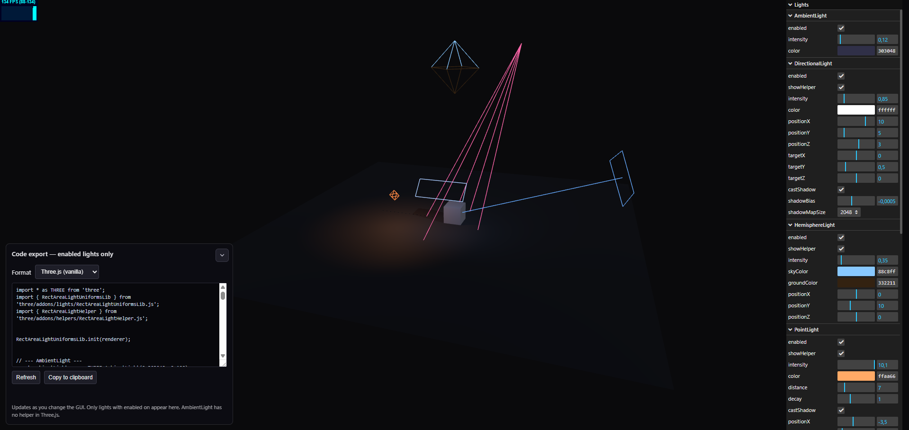

# Three.js — Lighting Generator

A small web demo to **compose a lighting setup** in [Three.js](https://threejs.org/), tweak helpers and shadows, then **copy ready-to-paste code** into your own project (vanilla Three.js or React Three Fiber).

## Preview



## Live demo

**[Open the live demo](https://tolexia.github.io/threejs-lighting-generator)**

## Features

- Reference scene (ground, cube, PBR materials) with **shadows** and **OrbitControls**.
- **Light types** in a [lil-gui](https://lil-gui.georgealways.com/) panel: Ambient, Directional, Hemisphere, Point, Spot, RectArea (with `RectAreaLightUniformsLib`).
- Per-light enable/disable and **helpers** (Ambient has no native helper in Three.js).
- **Code export** panel: **enabled** lights only, **vanilla Three.js** or **React Three Fiber** format, refresh and clipboard copy.
- **Stats** (FPS) overlay for quick performance checks.

## Tech stack

- Plain HTML, CSS, and ES modules.
- Three.js **0.183.0** via [import map](https://developer.mozilla.org/en-US/docs/Web/HTML/Reference/Elements/script/type/importmap) and [esm.sh](https://esm.sh/) (`three` and `examples/jsm` addons).

## Run locally

ES modules and the import map need an HTTP origin (not `file://`). From the repo root:

```bash
npx --yes serve .
```

Then open the URL printed in the terminal (often `http://localhost:3000`).

## Repository layout

| File          | Purpose                                      |
| ------------- | -------------------------------------------- |
| `index.html`  | Page shell, import map, export panel         |
| `main.js`     | Three.js scene, GUI, code generation         |
| `style.css`   | Layout (canvas + code panel)                 |
| `preview.png` | Screenshot for README / docs                 |

